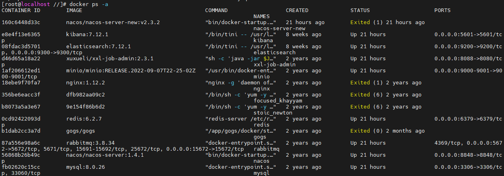
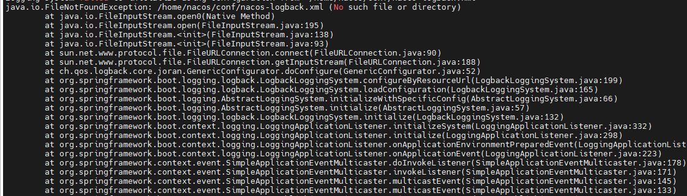
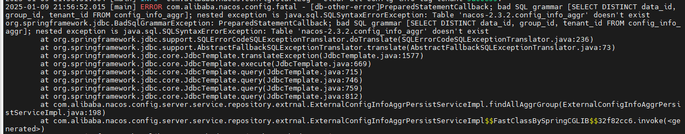
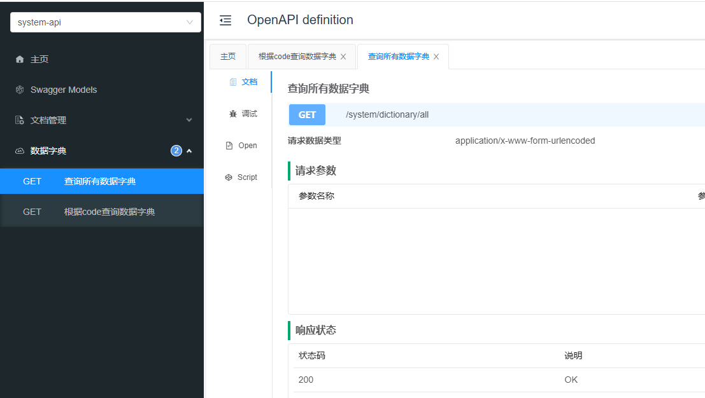

# BUG修复记录

## 后端

### 打包为可运行的 JAR/WAR 文件

加入如下meaven配置

```xml
<build>
    <plugins>
        <plugin>
            <groupId>org.springframework.boot</groupId>
            <artifactId>spring-boot-maven-plugin</artifactId>
            <configuration>
                <mainClass>com.edu.kaizhi.Application</mainClass>
            </configuration>
        </plugin>
    </plugins>
</build>
```

插件支持配置启动类、依赖范围过滤、自定义 JAR 文件名等。

需要注意的是：如果模块是一个独立的 Spring Boot 应用（比如它也可以单独运行），那么在该模块的 `pom.xml` 中应该添加 `spring-boot-maven-plugin` 配置，如果不是 Spring Boot 应用，可以不用加入这段话


### openfeign调用时令牌不会同时传递问题

使用一个拦截器得到令牌

```java
@Component
public class FeignRequestInterceptor implements RequestInterceptor {
    private static final Pattern BEARER_TOKEN_HEADER_PATTERN = Pattern.compile("^Bearer (?<token>[a-zA-Z0-9-._~+/]+=*)$",
            Pattern.CASE_INSENSITIVE);

    @Override
    public void apply(RequestTemplate template) {
        final String authorization = HttpHeaders.AUTHORIZATION;
        ServletRequestAttributes requestAttributes = (ServletRequestAttributes) RequestContextHolder.getRequestAttributes();
        if (Objects.nonNull(requestAttributes)) {
            String authorizationHeader = requestAttributes.getRequest().getHeader(HttpHeaders.AUTHORIZATION);
            Matcher matcher = BEARER_TOKEN_HEADER_PATTERN.matcher(authorizationHeader);
            if (matcher.matches()) {
                template.header(authorization);
                template.header(authorization, authorizationHeader);
            }
        }
    }
}
```

在配置中使用这个请求拦截器

```java
@Configuration
public class FeignConfig {
    /**
     * 用于实现令牌信息中继的feign配置
     */
    @Bean
    public RequestInterceptor requestInterceptor() {
        return new FeignRequestInterceptor();
    }

    @Bean
    public Logger.Level feignLoggerLevel() {
        return Logger.Level.FULL;
    }

    // 启用 Feign 的上下文传播功能
    @Bean
    public Feign.Builder feignBuilder() {
        return Feign.builder().requestInterceptor(new FeignRequestInterceptor());
    }
}
```

最后，在feign过程调用这个配置项

```java
@FeignClient(value = "media-api", configuration = {MultipartSupportConfig.class, FeignConfig.class}, fallbackFactory = MediaServiceClientFallbackFactory.class)
public interface MediaServiceClient {

    @RequestMapping(value = "/media/upload/coursefile", consumes = MediaType.MULTIPART_FORM_DATA_VALUE)
    String uploadFile(@RequestPart("filedata") MultipartFile upload, @RequestParam(value = "objectName", required = false) String objectName,
                      @RequestParam(value = "companyId", required = false) Long companyId);

    @DeleteMapping(value = "/media/delete/coursefile/{courseId}")
    void deleteCourseFile(@PathVariable("courseId") String courseId);
}
```

注意，这样操作适用于可以得到上下文前提下，在代码中由于使用xxl-job，所以没办法得到上下文，所以还是会传递一个匿名用户的字符串给另一个微服务，只能手动传递公司ID，使得不需要令牌也可以校验。


### 使用@Cacheable一直无法正确序列化时间，导致取出时候有问题

原因是使用GenericJackson2JsonRedisSerializer，存入的一直是一个数组类，导致无法再序列化会正确类

设置时间格式化、可以添加一个Bean、也可以使用`@JsonFormat`注解

1. 添加一个Bean

```java
@Configuration
public class JacksonConfig {

    @Bean
    public ObjectMapper objectMapper() {
        ObjectMapper objectMapper = new ObjectMapper();
        // 注册 JavaTimeModule 来处理 Java 8 时间类型
        JavaTimeModule javaTimeModule = new JavaTimeModule();
        javaTimeModule.addSerializer(LocalDateTime.class, new LocalDateTimeSerializer(DateTimeFormatter.ofPattern("yyyy-MM-dd HH:mm:ss")));
        javaTimeModule.addSerializer(LocalDate.class, new LocalDateSerializer(DateTimeFormatter.ofPattern("yyyy-MM-dd")));
        javaTimeModule.addSerializer(LocalTime.class, new LocalTimeSerializer(DateTimeFormatter.ofPattern("HH:mm:ss")));
        objectMapper.registerModule(javaTimeModule);
        return objectMapper;
    }
}
```

2. 使用注解 `@JsonFormat(pattern = "yyyy-MM-dd HH:mm:ss", timezone = "GMT+8")`，其中patter设置成对应的时间格式就可

二、在实体类字段上设置反序列化方式。

```java
    @JsonDeserialize(using = LocalDateTimeDeserializer.class)
    @JsonSerialize(using = LocalDateTimeSerializer.class)
    @JSONField(format = "yyyy-MM-dd HH:mm:ss")
    @JsonFormat(pattern = "yyyy-MM-dd HH:mm:ss")
    private LocalDateTime createDate;
```

这样就可以正确解决时间无法反序列化问题


### springboot下用cache注解整合redis并使用json序列化、反序列化

只需要在配置文件中配置一下CacheManger,使用jackson的一个带泛型的序列化工具实现。

```java
@Bean
    public CacheManager cacheManager(RedisConnectionFactory factory) {
        GenericJackson2JsonRedisSerializer jsonRedisSerializer = new GenericJackson2JsonRedisSerializer();
        StringRedisSerializer stringRedisSerializer = new StringRedisSerializer();
        // 配置序列化
        RedisCacheConfiguration config = RedisCacheConfiguration.defaultCacheConfig();
        RedisCacheConfiguration redisCacheConfiguration = config
                // 键序列化方式 redis字符串序列化
                .serializeKeysWith(RedisSerializationContext.SerializationPair.fromSerializer(stringRedisSerializer))
                // 值序列化方式 简单json序列化
                .serializeValuesWith(RedisSerializationContext.SerializationPair.fromSerializer(jsonRedisSerializer));
        return RedisCacheManager.builder(factory).cacheDefaults(redisCacheConfiguration).build();

    }
```


### media微服务swagger一直报错：Request method 'GET' not supported

逐步开启controller查看swagger是否会失败，最终确认是MediaFilesController问题，再逐个打开函数查看，发现只要这个函数出现就会导致swagger无法运行

```java
@ApiOperation("刪除媒资文件")
@RequiresUser
@DeleteMapping("/{mediaId}")
public void deleteMediaByMediaId(@PathVariable String mediaId) {
    Long companyId = UserContext.getCompanyId();
    mediaFileService.deleteFileById(companyId, mediaId);
}
```

将路径改为

```java
@DeleteMapping(value = "/delete/{mediaId}")
```

这样就不会报错了，swagger正确显示。估计是 delete直接使用id 作为路径参数，容易有问题，所以被禁止了


### 升级版本时候发现Failed to execute goal org.apache.maven.plugins:maven-compiler-plugin:3.13.0:compile 错误: 不支持发行版本 21

这个是JDK升级成21以后打包出现的一个问题。

首先要先确保MAVEN版本不能低于3.8.1，其次保证Java版本与maven对应，IDEA中设置好新的MVAEN，项目结构里面设置好每一个项目和模块的SDK

最后注意在这个位置:

IDEA中File > Settings > Build, Execution, Deployment > Build Tools > Maven > Runner里面还有个运行的JDK路径，这个改了就能运行了


### 升级版本时候 Spring Cloud 项目使用 bootstrap.yml 配置文件，添加 nacos 等相关参数配置，启动服务抛入如下异常:

```
Description:
No spring.config.import property has been defined
Action:
Add a spring.config.import=nacos: property to your configuration.
	If configuration is not required add spring.config.import=optional:nacos: instead.
	To disable this check, set spring.cloud.nacos.config.import-check.enabled=false.
```

导致上述异常的原因是 Spring Cloud 不再默认启用 bootstrap 包。


解决方式一：
使用 application.yaml，在配置文件中通过 spring.config.import=nacos: property to your configuration. 方式进行配置加载：

spring:
  config:
    import: nacos: xxx.yaml

解决方式二：
在 pom.xml 中引入 boostrap 依赖包：

```yml
<!-- https://mvnrepository.com/artifact/org.springframework.cloud/spring-cloud-starter-bootstrap -->
<dependency>
    <groupId>org.springframework.cloud</groupId>
    <artifactId>spring-cloud-starter-bootstrap</artifactId>
    <version>3.1.7</version>
</dependency>
```


### 项目从JAVA8到JAVA21历程

将全部包打到最新版本，发现有几个包迁移了(此处旧的包均记录当前最高版本包)：

```xml
<dependency>
    <groupId>commons-lang</groupId>
    <artifactId>commons-lang</artifactId>
    <version>2.6</version>
</dependency>
---------------------------------------------------->
<dependency>
    <groupId>org.apache.commons</groupId>
    <artifactId>commons-lang3</artifactId>
    <version>3.17.0</version>
</dependency>
-------------------------------------------------------------
<dependency>
    <groupId>mysql</groupId>
    <artifactId>mysql-connector-java</artifactId>
    <version>8.0.33</version>
</dependency>
---------------------------------------------------->
<dependency>
    <groupId>com.mysql</groupId>
    <artifactId>mysql-connector-j</artifactId>
    <version>9.1.0</version>
</dependency>
```

注意：在spring-boot升级为3后，有包需要整个迁移到新的包依赖

```xml
<dependency>
   <groupId>com.baomidou</groupId>
   <artifactId>mybatis-plus-boot-starter</artifactId>
   <version>3.4.1</version>
</dependency>
---------------------------------------------------->
<dependency>
    <groupId>com.baomidou</groupId>
    <artifactId>mybatis-plus-spring-boot3-starter</artifactId>
    <version>3.5.9</version>
</dependency>
-------------------------------------------------------------
```

升级到最新崩溃发现，nacos和spring boot和spring cloud都需要对应上，不然配置可能无法找到，[nacos配置说明](https://sca.aliyun.com/docs/2023/overview/version-explain/?spm=7145af80.729011b0.0.0.55432d5btg3SbY)

**2023.x 分支**

适配 Spring Boot 3.2，Spring Cloud 2023.x 版本及以上的 Spring Cloud Alibaba 版本按从新到旧排列如下表（最新版本用*标记）：

| Spring Cloud Alibaba Version | Spring Cloud Version  | Spring Boot Version |
| ---------------------------- | --------------------- | ------------------- |
| 2023.0.1.0*                  | Spring Cloud 2023.0.1 | 3.2.4               |
| 2023.0.0.0-RC1               | Spring Cloud 2023.0.0 | 3.2.0               |

可以参考文章：

https://www.cnblogs.com/zhaojinhui/p/18619651

https://docs.oracle.com/en/java/javase/21/docs/api/deprecated-list.html

https://juejin.cn/post/7326393655392190501

https://github.com/spring-projects/spring-boot/wiki/Spring-Boot-3.0-Migration-Guide#redis-properties

https://docs.oracle.com/en/java/javase/21/migrate/migrating-jdk-8-later-jdk-releases.html#GUID-7744EF96-5899-4FB2-B34E-86D49B2E89B6


### Docker pull拉取一直不成功，拉取nacos时一直失败

[root@localhost 桌面]# docker pull nacos/nacos-server:v2.3.2
Error response from daemon: Get https://registry-1.docker.io/v2/: net/http: request canceled while waiting for connection (Client.Timeout exceeded while awaiting headers)


可以直接绕过 https://registry-1.docker.io/v2/下载，使用

```
docker pull nacos-registry.cn-hangzhou.cr.aliyuncs.com/nacos/nacos-server:v2.3.2
```


### 拉取nacos后，启动容器nacos一直失败

直接使用如下命令：
```cmd
 docker run -d --name nacos-server-new -p 8849:8849 nacos/nacos-server-new:v2.3.2
```

出现问题，容器启动失败，并且无法再次启动，因为失败的容器创建会导致名字被占用，在`docker ps -a`显示失败：



使用`docker rm nacos-server-new`指令先去除相同名字nacos

在第一次建nacos时需要配置数据库，这里建一个数据库并且命名为nacos-2.3.2，再导入一些表"可能根据包版本配置比较好"，位置在https://github.com/alibaba/nacos/blob/8a136c209cddae0549933ae082415deac774e47c/config/src/main/resources/META-INF/mysql-schema.sql

再进行配置conf,init.d,logs文件夹和application.properties，在init.d/custom.properties和conf/application.properties也需要配置好，最后使用命令挂载

```cmd
docker run -d --name nacos-server-new -p 8849:8849 -p 9848:9849 -p 9849:9849 -e MODE=standalone -v /data/soft/nacos-new/logs:/home/nacos/logs -v /data/soft/nacos-new/init.d/custom.properties:/home/nacos/init.d/custom.properties -v /data/soft/nacos-new/conf:/home/nacos/conf nacos/nacos-server-new:v2.3.2
```

其实应该是8848的，但是此处使用8849，因为之前nacos还在运行

运行后发现还是无法正常启动，使用`docker logs nacos-server`查看启动日志，发现



发现还要配置nacos-logback.xml，如下

```xml
<configuration>
    <appender name="STDOUT" class="ch.qos.logback.core.ConsoleAppender">
        <!-- 设置日志输出的目标控制台 -->
        <target>System.out</target>
        <encoder>
            <!-- 设置日志输出格式 -->
            <pattern>%d{yyyy-MM-dd HH:mm:ss.SSS} [%thread] %-5level %logger{36} - %msg%n</pattern>
        </encoder>
    </appender>

    <logger name="com.alibaba.nacos" level="INFO" additivity="false">
        <appender-ref ref="STDOUT" />
    </logger>

    <root level="INFO">
        <appender-ref ref="STDOUT" />
    </root>
</configuration>
```

记得需要UTF-8格式，使用`file -i /xxx/conf/nacos-logback.xml`查看文件格式

在使用官网的mysql建表还是会出现一个报错：


暂时不知道为什么会继续使用旧版本的config_info_aggr表，但是可以使用旧版本sql建表

```sql
CREATE TABLE `config_info_aggr` (
  `id` bigint(20) NOT NULL AUTO_INCREMENT COMMENT 'id',
  `data_id` varchar(255) COLLATE utf8_bin NOT NULL COMMENT 'data_id',
  `group_id` varchar(255) COLLATE utf8_bin NOT NULL COMMENT 'group_id',
  `datum_id` varchar(255) COLLATE utf8_bin NOT NULL COMMENT 'datum_id',
  `content` longtext COLLATE utf8_bin NOT NULL COMMENT '内容',
  `gmt_modified` datetime NOT NULL COMMENT '修改时间',
  `app_name` varchar(128) COLLATE utf8_bin DEFAULT NULL,
  `tenant_id` varchar(128) COLLATE utf8_bin DEFAULT '' COMMENT '租户字段',
  PRIMARY KEY (`id`),
  UNIQUE KEY `uk_configinfoaggr_datagrouptenantdatum` (`data_id`,`group_id`,`tenant_id`,`datum_id`)
) ENGINE=InnoDB DEFAULT CHARSET=utf8 COLLATE=utf8_bin COMMENT='增加租户字段';
```

至此，nacos就可以顺利运行


### nacos从1.4到2.3后，extension-configs和shared-configs一直无法生效

```yml
spring:
  application:
    name: system-api # 微服务名

  # 数据源配置，默认dev
  profiles:
    active: dev # 环境名，指定配置文件的名称

  cloud:
    nacos:
      server-addr: 192.168.101.65:8848
      discovery: # 服务注册相关配置
        namespace: kaizhi_edu
        group: kaizhi-education
      config: # 配置文件相关信息
        namespace: kaizhi_edu
        group: kaizhi-education
        # 找到自己特有配置文件
        prefix: system-api
        file-extension: yaml
        refresh-enabled: true
        extension-configs:
          # 找到引用的数据库配置文件
          - data-id: system-service-${spring.profiles.active}.yaml
            group: kaizhi-education
            refresh: true
        # 找到共享的配置文件
        shared-configs:
          - data-id: logging-${spring.profiles.active}.yaml
            group: kaizhi-education-common
            refresh: true
```

这是之前配置，但是一直无法正确导入nacos中的包，失败信息为数据库未连接，原因是system-service配置数据库url，此处未读取到

查阅资料，第一次修改尝试：

```yml
#微服务配置
spring:
  application:
    name: system-api # 微服务名

  # 数据源配置，默认dev
  profiles:
    active: dev # 环境名，指定配置文件的名称

  cloud:
    nacos:
      server-addr: 192.168.101.65:8849
      discovery:
        server-addr: 192.168.101.65:8849
        namespace: kaizhi_edu
        group: kaizhi-education
      config:
        server-addr: 192.168.101.65:8849
        namespace: kaizhi_edu
        group: kaizhi-education
        # 找到自己特有配置文件
        prefix: system-api
        file-extension: yml
        refresh-enabled: true
        extension-configs:
          # 找到引用的数据库配置文件
          - nacos:system-service-${spring.profiles.active}.yaml?group=kaizhi-education
        shared-configs:
          - nacos:logging-${spring.profiles.active}.yaml?group=kaizhi-education-common
```

无效，第二次尝试：

```yml
#微服务配置
spring:
  application:
    name: system-api # 微服务名

  # 数据源配置，默认dev
  profiles:
    active: dev # 环境名，指定配置文件的名称

  cloud:
    nacos:
      server-addr: 192.168.101.65:8848
      discovery: # 服务注册相关配置
        namespace: kaizhi_edu
        group: kaizhi-education
      config: # 配置文件相关信息
        namespace: kaizhi_edu
        group: kaizhi-education
        # 找到自己特有配置文件
        prefix: system-api
        file-extension: yaml
        refresh-enabled: true
        extension-configs[3]:
          # 找到引用的数据库配置文件
          data-id: system-service-${spring.profiles.active}.yaml
          group: kaizhi-education
          refresh: true
        # 找到共享的配置文件
        shared-configs[3]:
          data-id: logging-${spring.profiles.active}.yaml
          group: kaizhi-education-common
          refresh: true
```

无效，更多的报错，最后使用新的配置才生效，直接将所有配置一次性放到config.import

```xml
#微服务配置
spring:
  application:
    name: system-api # 微服务名

  # 数据源配置，默认dev
  profiles:
    active: dev # 环境名，指定配置文件的名称

  config:
    import:
      - nacos:system-api-${spring.profiles.active}.yaml?group=kaizhi-education&refresh=true
      - nacos:system-service-${spring.profiles.active}.yaml?group=kaizhi-education&refresh=true
      - nacos:logging-${spring.profiles.active}.yaml?group=kaizhi-education-common&refresh=true
  cloud:
    nacos:
      server-addr: 192.168.101.65:8849
      discovery:
        server-addr: 192.168.101.65:8849
        namespace: kaizhi_edu
      config:
        server-addr: 192.168.101.65:8849
        namespace: kaizhi_edu
```

奇迹般生效了

其实SpringBoot从 2.4.x 版本开始支持了导入文件的方式来加载配置参数，Nacos在SpringCloud Alibaba发布了2021.0.1.0版本后对spring.config.import做了支持，可以直接通过加载Nacos Server内指定的配置文件。其实官网也有说明这个情况：https://nacos.io/blog/faq/nacos-user-question-history15396/。只是没注意到这个信息导致调试好久才完成，也想到还能传入一个config数组。


### Spring Boot3使用Spring boot2熔断降级导致报错

spring-cloud-starter-openfeign:2.2.6.RELEASE，更新为4.4.1

之前熔断降级代码如下：

```java
import feign.hystrix.FallbackFactory;
import lombok.extern.slf4j.Slf4j;
import org.springframework.stereotype.Component;

@Slf4j
@Component
public class AuthServiceFeignClientFactory implements FallbackFactory<AuthServiceFeignClient> {
    @Override
    public AuthServiceFeignClient create(Throwable throwable) {
        return (accessToken) -> {
            log.debug("调用刷新JWT令牌服务熔断异常:{}", throwable.getMessage());
            return null;
        };
    }
}
```

```java
import feign.hystrix.FallbackFactory;
import lombok.extern.slf4j.Slf4j;
import org.springframework.stereotype.Component;

@Slf4j
@Component
public class AuthServiceFeignClientFactory implements FallbackFactory<AuthServiceFeignClient> {
    @Override
    public AuthServiceFeignClient create(Throwable throwable) {
        return (accessToken) -> {
            log.debug("调用刷新JWT令牌服务熔断异常:{}", throwable.getMessage());
            return null;
        };
    }
}
```

包一开始直接发生报错，无法找到`feign.hystrix.FallbackFactory;`，修改包路径和函数：

```java
import org.springframework.cloud.openfeign.FallbackFactory;
import lombok.extern.slf4j.Slf4j;
import org.springframework.stereotype.Component;

@Slf4j
@Component
public class AuthServiceFeignClientFactory implements FallbackFactory<AuthServiceFeignClient> {
    @Override
    public AuthServiceFeignClient create(Throwable throwable) {
        log.debug("调用刷新JWT令牌服务熔断异常:{}", throwable.getMessage());
        return null;
    }
}
```

更新时发生报错，依赖循环

```java
Description:

The dependencies of some of the beans in the application context form a cycle:

┌─────┐
|  gatewayAuthFilter (field private com.edu.kaizhi.feignclient.AuthServiceFeignClient com.edu.kaizhi.config.GatewayAuthFilter.authServiceFeignClient)
↑     ↓
|  com.edu.kaizhi.feignclient.AuthServiceFeignClient
↑     ↓
|  corsGatewayFilterApplicationListener defined in class path resource [org/springframework/cloud/gateway/config/GatewayAutoConfiguration.class]
↑     ↓
|  routePredicateHandlerMapping defined in class path resource [org/springframework/cloud/gateway/config/GatewayAutoConfiguration.class]
↑     ↓
|  filteringWebHandler defined in class path resource [org/springframework/cloud/gateway/config/GatewayAutoConfiguration.class]
└─────┘

Action:

Relying upon circular references is discouraged and they are prohibited by default. Update your application to remove the dependency cycle between beans. As a last resort, it may be possible to break the cycle automatically by setting spring.main.allow-circular-references to true.
```

有两种方法：

1. 使用@Lazy注解，使用部分直接加入注解，这样即可解决依赖循环问题。

```java
@Autowired
@Lazy
private AuthServiceFeignClient authServiceFeignClient;
```

2. 使用懒加载解决

使用前导入使用**懒加载**，延迟依赖的初始化，从而避免循环依赖：

```java
// 懒加载authServiceFeignClient避免循环依赖
private final ObjectProvider<AuthServiceFeignClient> authServiceFeignClientProvider;

public GatewayAuthFilter(ObjectProvider<AuthServiceFeignClient> authServiceFeignClientProvider) {
    this.authServiceFeignClientProvider = authServiceFeignClientProvider;
}
// ...
// 使用时
// 从 Feign 容器中获取 AuthServiceFeignClient 实例
AuthServiceFeignClient authServiceFeignClient = authServiceFeignClientProvider.getIfAvailable();
if (authServiceFeignClient == null) {
   log.warn("AuthServiceFeignClient is unavailable");
   return buildReturnMono("Unauthorized: Service Unavailable", exchange);
}
```


### 修复ERROR-level Root logger with Console appender

报错详情：

```
WARN StatusConsoleListener The use of package scanning to locate plugins is deprecated and will be removed in a future release
WARN StatusConsoleListener No Root logger was configured, creating default ERROR-level Root logger with Console appender
```

在使用新版本nacos时，`com.alibaba.nacos.client.utils.LogUtils` 这个类内部会根据你的日志框架，去读取对应日志框架的配置文件，比如 log4j2 的 `log4j2.json`，`log4j2.xml` 等，然后去重新刷新日志配置，但是由于项目用的是 log4j2，日志配置文件为 `log4j2-dev.xml`，不在读取范围内，然后取了默认的配置 nacos-client.jar 这个jar包内的 `nacos-log4j2.xml` 配置。这个文件是没有设置 `Root` 的, 所以才有上面的提示。

所以想要解决的话：(使用 logback 类似的改法)

1. 设置属性为false

```java
System.setProperty("nacos.logging.default.config.enabled","false");
```

2. 把配置文件改为为正常的 log4j2的文件格式: 如 `log4j2.xml`。


### 去除is not eligible for getting processed by all BeanPostProcessors

```
2025-01-12 20:45:31,138 WARN [main][PostProcessorRegistrationDelegate.java:429] - Bean 'com.alibaba.cloud.nacos.NacosConfigAutoConfiguration' of type [com.alibaba.cloud.nacos.NacosConfigAutoConfiguration] is not eligible for getting processed by all BeanPostProcessors (for example: not eligible for auto-proxying). The currently created BeanPostProcessor [nacosAnnotationProcessor] is declared through a non-static factory method on that class; consider declaring it as static instead.
2025-01-12 20:45:31,142 WARN [main][PostProcessorRegistrationDelegate.java:437] - Bean 'nacosConfigProperties' of type [com.alibaba.cloud.nacos.NacosConfigProperties] is not eligible for getting processed by all BeanPostProcessors (for example: not eligible for auto-proxying). Is this bean getting eagerly injected into a currently created BeanPostProcessor [nacosAnnotationProcessor]? Check the corresponding BeanPostProcessor declaration and its dependencies.
2025-01-12 20:45:31,142 WARN [main][PostProcessorRegistrationDelegate.java:437] - Bean 'nacosConfigManager' of type [com.alibaba.cloud.nacos.NacosConfigManager] is not eligible for getting processed by all BeanPostProcessors (for example: not eligible for auto-proxying). Is this bean getting eagerly injected into a currently created BeanPostProcessor [nacosAnnotationProcessor]? Check the corresponding BeanPostProcessor declaration and its dependencies.
```

三个警告，其中后两个在更新spring-cloud-alibaba-dependencies包版本为2023.0.3.2后消失，最前面的一个似乎到现在都无法解决。


### 网关升级后无法转发

```
org.springframework.cloud.gateway.support.NotFoundException: 503 SERVICE_UNAVAILABLE "Unable to find instance for system-api"
	at org.springframework.cloud.gateway.support.NotFoundException.create(NotFoundException.java:45)
	at org.springframework.cloud.gateway.config.GatewayNoLoadBalancerClientAutoConfiguration$NoLoadBalancerClientFilter.filter(GatewayNoLoadBalancerClientAutoConfiguration.java:79)
	at org.springframework.cloud.gateway.handler.FilteringWebHandler$GatewayFilterAdapter.filter(FilteringWebHandler.java:147)
	at org.springframework.cloud.gateway.filter.OrderedGatewayFilter.filter(OrderedGatewayFilter.java:44)
```

这是由于缺少loadbalancer依赖，因为在`Spring Cloud 2020`版本以后，就移除了[Ribbon](https://so.csdn.net/so/search?q=Ribbon&spm=1001.2101.3001.7020)负载均衡器，官方默认推荐使用`Spring Cloud Loadbalancer`正式替换`Ribbon。`加入如下即可

```xml
<!--负载均衡器依赖-->
<dependency>
    <groupId>org.springframework.cloud</groupId>
    <artifactId>spring-cloud-starter-loadbalancer</artifactId>
</dependency>
```


### 网关更新依赖运行过程中产生报错java.lang.NoSuchMethodError

```
2025-01-12 22:01:34,573 ERROR [boundedElastic-3][Loggers.java:324] - Scheduler worker in group main failed with an uncaught exception
java.lang.NoSuchMethodError: 'java.util.Set org.springframework.http.HttpHeaders.headerSet()'
    at org.springframework.cloud.gateway.filter.headers.ForwardedHeadersFilter.filter(ForwardedHeadersFilter.java:99)
    at org.springframework.cloud.gateway.filter.headers.HttpHeadersFilter.filter(HttpHeadersFilter.java:38)
	at org.springframework.cloud.gateway.filter.headers.HttpHeadersFilter.filterRequest(HttpHeadersFilter.java:28)
	at org.springframework.cloud.gateway.filter.NettyRoutingFilter.filter(NettyRoutingFilter.java:125)
	at org.springframework.cloud.gateway.handler.FilteringWebHandler$GatewayFilterAdapter.filter(FilteringWebHandler.java:147)
	at org.springframework.cloud.gateway.filter.OrderedGatewayFilter.filter(OrderedGatewayFilter.java:44)
	at org.springframework.cloud.gateway.handler.FilteringWebHandler$DefaultGatewayFilterChain.lambda$filter$0(FilteringWebHandler.java:127)
...
```

问题在于Spring Cloud Gateway版本不兼容Spring Framework版本，如何定位不兼容的包：因为报错提示是 org.springframework，而产生这个报错并不是启动时候产生，而是因为使用网关路由转发时候产生的，因此可以判断这两个包或许不兼容，将spring boot对应3.2.4以及spring cloud对应2023.0.1错误消失，在官网有版本对应表：https://spring.io/projects/spring-cloud


### 使用knife4j找不到/v3/api-docs/swagger-config

原因是knife4j无法单纯使用以下依赖完成

```xml
<dependency>
    <groupId>com.github.xiaoymin</groupId>
    <artifactId>knife4j-openapi3-jakarta-spring-boot-starter</artifactId>
    <version>4.4.0</version>
</dependency>
```

还必须配合**swagger-ui**一起使用

```xml
<dependency>
        <groupId>org.springdoc</groupId>
        <artifactId>springdoc-openapi-starter-webmvc-ui</artifactId>
        <version>2.0.2</version>
 </dependency>
 <dependency>
        <groupId>com.github.xiaoymin</groupId>
        <artifactId>knife4j-openapi3-jakarta-spring-boot-starter</artifactId>
        <version>4.4.0</version>
</dependency>
```

最后创建配置类：

```java
@Configuration
public class Knife4jConfig {
    @Bean
    public OpenAPI springOpenAPI() {
        return new OpenAPI().info(new Info() //
                .title("SpringDoc API Test") //
                .description("SpringDoc Simple Application Test") //
                .version("0.0.1"));
    }
```


### 加入springdoc-openapi-starter-webmvc-ui依赖报错

```
java.lang.IllegalStateException: Error processing condition on org.springdoc.webmvc.ui.SwaggerConfig.springWebProvider
	at org.springframework.boot.autoconfigure.condition.SpringBootCondition.matches(SpringBootCondition.java:60)
```

在官网找到如下的版本对应关系：https://springdoc.org/#what-is-the-compatibility-matrix-of-springdoc-openapi-with-spring-boot

What is the compatibility matrix of `springdoc-openapi` with `spring-boot` ?

`springdoc-openapi 2.x` is compatible with `spring-boot 3`.

In general, **you should only pick the last stable version as per today 2.8.3.**

More precisely, this the exhaustive list of spring-boot versions against which `springdoc-openapi` has been built:

| Spring Boot Versions | Springdoc OpenAPI Versions |
| -------------------- | -------------------------- |
| `3.4.x`              | `2.7.x` - `2.8.x`          |
| `3.3.x`              | `2.6.x`                    |
| `3.2.x`              | `2.3.x` - `2.5.x`          |
| `3.1.x`              | `2.2.x`                    |
| `3.0.x`              | `2.0.x` - `2.1.x`          |
| `2.7.x`, `1.5.x`     | `1.6.0`+                   |
| `2.6.x`, `1.5.x`     | `1.6.0`+                   |
| `2.5.x`, `1.5.x`     | `1.5.9`+                   |
| `2.4.x`, `1.5.x`     | `1.5.0`+                   |
| `2.3.x`, `1.5.x`     | `1.4.0`+                   |
| `2.2.x`, `1.5.x`     | `1.2.1`+                   |
| `2.0.x`, `1.5.x`     | `1.0.0`+                   |

选择与自己项目适配版本即可解决


### 具有Nacos网关转发的springboot3微服务配置聚合knife4j 4

首先在依赖管理部分加入两个包

```xml
<knife4j.version>4.5.0</knife4j.version>
<openapi-ui.version>2.5.0</openapi-ui.version>

<!--knife4j-openapi3-->
<dependency>
    <groupId>com.github.xiaoymin</groupId>
    <artifactId>knife4j-openapi3-jakarta-spring-boot-starter</artifactId>
    <version>${knife4j.version}</version>
    <exclusions>
        <exclusion>
            <groupId>org.projectlombok</groupId>
            <artifactId>lombok</artifactId>
        </exclusion>
    </exclusions>
</dependency>
<dependency>
    <groupId>com.github.xiaoymin</groupId>
    <artifactId>knife4j-gateway-spring-boot-starter</artifactId>
    <version>${knife4j.version}</version>
    <exclusions>
        <exclusion>
            <groupId>org.projectlombok</groupId>
            <artifactId>lombok</artifactId>
        </exclusion>
    </exclusions>
</dependency>
<!--knife4j-openapi3必须配合swagger-ui一起使用-->
<dependency>
    <groupId>org.springdoc</groupId>
    <artifactId>springdoc-openapi-starter-webmvc-ui</artifactId>
    <version>${openapi-ui.version}</version>
</dependency>
```

之后，在每个服务子包下加入

```xml
<dependency>
    <groupId>org.springdoc</groupId>
    <artifactId>springdoc-openapi-starter-webmvc-ui</artifactId>
</dependency>
```

这个子包加入是为了让"找不到/v3/api-docs/swagger-config"警告消除

之后在gateway依赖加入

```xml
<!--Knife4j 网关聚合-->
<dependency>
    <groupId>com.github.xiaoymin</groupId>
    <artifactId>knife4j-gateway-spring-boot-starter</artifactId>
</dependency>
<dependency>
    <groupId>com.github.xiaoymin</groupId>
    <artifactId>knife4j-openapi3-jakarta-spring-boot-starter</artifactId>
</dependency>
<!--knife4j-openapi3必须配合swagger-ui一起使用-->
<dependency>
    <groupId>org.springdoc</groupId>
    <artifactId>springdoc-openapi-starter-webmvc-ui</artifactId>
</dependency>
```

并且使用配置

```yml
config:
  import:
    # 找到自己特有配置文件
    - nacos:gateway-${spring.profiles.active}.yaml?group=kaizhi-education&refresh=true
```

在nacos的配置为

```yaml
server:
  port: 63010 # 网关端口
spring:
  cloud:
    gateway:
      routes: # 网关路由配置
        - id: content-api # 路由id，自定义，只要唯一即可
          # uri: http://127.0.0.1:8081 # 路由的目标地址 http就是固定地址
          uri: lb://content-api # 路由的目标地址 lb就是负载均衡，后面跟服务名称
          predicates: # 路由断言，也就是判断请求是否符合路由规则的条件
            - Path=/content/** # 这个是按照路径匹配，只要以/content/开头就符合要求
        - id: system-api
          uri: lb://system-api
          predicates:
            - Path=/system/**
        
knife4j:
  gateway:
    # 第一个配置，开启gateway聚合组件
    enabled: true
    # 指定服务发现的模式聚合微服务文档，并且是默认`default`分组
    strategy: discover
    discover:
      # 第三行配置，开启discover模式
      enabled: true
      # 指定版本号(Swagger2|OpenAPI3)
      version : openapi3
      # 需要排除的微服务
      excluded-services:
        - gateway
```

最后在gateway的config下加入两个配置

```java
@Configuration
@Slf4j
public class WebConfig implements WebMvcConfigurer {
    @Override
    public void addResourceHandlers(ResourceHandlerRegistry registry) {
        log.info("设置静态资源映射...");
        // 添加静态资源映射规则
        registry.addResourceHandler("/static/**").
                addResourceLocations("classpath:/static/");
        // 配置 knife4j 的静态资源请求映射地址
        registry.addResourceHandler("/doc.html")
                .addResourceLocations("classpath:/META-INF/resources/");
        registry.addResourceHandler("/webjars/**")
                .addResourceLocations("classpath:/META-INF/resources/webjars/");
    }
}
```

```java
@Configuration
@Slf4j
public class Knife4jConfig {
    /**
     * 配置基本信息
     */
    @Bean
    public OpenAPI openAPI() {
        return new OpenAPI()
                .info(new Info()
                        // 标题
                        .title("平台接口文档")
                        // 描述Api接口文档的基本信息
                        .description("Knife4j后端接口服务...")
                        // 版本
                        .version("v1.0.0")
                        // 设置OpenAPI文档的联系信息，姓名，邮箱。
                        .contact(new Contact().name(""))
                        // 设置OpenAPI文档的许可证信息，包括许可证名称为"Apache 2.0"，许可证URL为"http://springdoc.org"。
                        .license(new License().name("Apache 2.0").url("http://springdoc.org"))
                );
    }
}
```

即可大功告成




### jakarta.mail发邮件导致报错：Exception in thread "main" java.lang.IllegalStateException: No provider of jakarta.mail.util.StreamProvider was found

出错代码为：

```java
Session mailSession = Session.getInstance(props, authenticator);
```

包使用了：

```xml
<dependency>
    <groupId>jakarta.mail</groupId>
    <artifactId>jakarta.mail-api</artifactId>
</dependency>
```

可以确认的是代码不可能出错，因为代码是从成功运行后再迁移的，因此只会是包的问题，使用

```xml
<dependency>
    <groupId>com.sun.mail</groupId>
    <artifactId>jakarta.mail</artifactId>
</dependency>
```

问题解决


### 解决docker pull超时问题

- 方法1： 修改国内镜像源
  修改daemon配置文件：vim /etc/docker/daemon.json

```
{
    "registry-mirrors": ["https://***吴彦祖的地址***.mirror.aliyuncs.com"]
}
```

推荐几个镜像源：

```
// docker 中国区镜像源
https://registry.docker-cn.com
// 网易镜像源
http://hub-mirror.c.163.com
// 阿里云镜像源
https://registry.cn-hangzhou.aliyuncs.com
```

国内可以正常访问的镜像网址，大部分镜像都有，可以作为一个应急下载源
第三方镜像-可信镜像中心网址：https://atomhub.openatom.cn/，下载示例

```
docker pull atomhub.openatom.cn/amd64/redis:7.0.2
```

- 方法2： 增加加速器
  1、修改daemon配置文件：vim /etc/docker/daemon.json

```
{
    "registry-mirrors": 
	[
		"https://do.nark.eu.org",
		"https://dc.j8.work",
		"https://docker.m.daocloud.io",
		"https://dockerproxy.com",
		"https://docker.mirrors.ustc.edu.cn",
		"https://docker.nju.edu.cn"
	]
}
```

两种方法修改完daemon.json后重启docker：

```
systemctl daemon-reload
systemctl restart docker 
```

附：阿里云个人镜像加速器
网址:https://cr.console.aliyun.com/cn-hangzhou/instances/mirrors


### 升级redis流程

选择当前稳定版本，拉取：

```
docker pull redis:7.4.2
```

在官网找到对应配置文件：

https://redis.io/docs/latest/operate/oss_and_stack/management/config/

按照自己之前配置保存相同的配置和不同的配置，放到自己指定的目录（此处为虚拟机，服务器的位置）：

```
 /home/docker/redis/config
```

指定redis.conf 启动

```
docker run -p 6379:6379 --name redis -v /home/docker/redis/config/redis.conf:/etc/redis/redis.conf -v /home/docker/redis/data:/data -d redis:5.0.5 redis-server /etc/redis/redis.conf --appendonly yes
```

参数说明：

注意：在docker中启动redis一定要把：daemonize 设置为 no，这个很重要，如果不是no docker会一直启动失败，原因是docker本身需要后台运行，而这个配置选项也是以守护进程启动，两者会冲突

1.-p 6379:6379：
第一个端口是宿主机端口(服务器端口)，第二个端口是容器端口(容器是一个个沙箱外部不不能访问的)，将容器的6379端口映射到宿主机的6379端口上，这样可以通过访问宿主机6379来访问redis;

2.–name redis：
容器的名字 redis 方便以后操作容器（docker start redis ;docker stop redis 等等);

3.-v /home/docker/redis/config/redis.conf:/etc/redis/redis.conf:
挂载持久化配置
/home/docker/redis/config/redis.conf ：是宿主机(服务器)你自己的redis.conf文件路径
/etc/redis/redis.conf : 容器内部的redis.conf文件路径，不用手动创建，容器启动时会把上边宿主机的redis.conf自动映射到改目录下. 这样在修改redis.conf文件时候就不用进入到容器内部去修改了

4.-v /home/docker/redis/data:/data：
挂载持久化文件
/home/docker/redis/data是宿主机中持久化文件的位置，/data是容器中持久化文件的位置

5.-d ：
后台启动

6.redis:5.0.5 redis-server /etc/redis/redis.conf：
redis:5.0.5 是镜像的名称+版本如下

7.redis-server /etc/redis/redis.conf
指定用配置文件的方式启动redis

8.–appendonly yes开启持久化

最后进入到容器内部验证下是否生成 redis.conf 和 data持久化文件

```bash
# 查看下正在运行的docker容器
[root@instance-f4khj00x /]# docker ps
CONTAINER ID        IMAGE               COMMAND                  CREATED             STATUS              PORTS                    NAMES
2ac032107e05        redis:5.0.5         "docker-entrypoint.s…"   11 minutes ago      Up 11 minutes       0.0.0.0:6379->6379/tcp   iredis

# 进入到容器内部
[root@instance-f4khj00x /]# docker container exec -it 2ac032107e05 /bin/bash

# 进入刚配置的容器目录 /etc/redis/redis.conf
root@2ac032107e05:/data# cd /etc/redis/   
root@2ac032107e05:/etc/redis# ls
redis.conf

# 进入持久化目录data
root@2ac032107e05:/etc/redis# cd /data/
root@2ac032107e05:/data# ls
appendonly.aof	backup.db  dump.rdb  root
```

删除容器流程：

停止容器

```
docker stop redis-new
```

删除容器

```
docker rm redis-new
```


### Redis-7.4.2 日志产生报错Failed to write PID file: Permission denied

```cmd
[root@localhost home]# docker logs redis-new
1:C 14 Jan 2025 09:18:22.305 # WARNING Memory overcommit must be enabled! Without it, a background save or replication may fail under low memory condition. Being disabled, it can also cause failures without low memory condition, see https://github.com/jemalloc/jemalloc/issues/1328. To fix this issue add 'vm.overcommit_memory = 1' to /etc/sysctl.conf and then reboot or run the command 'sysctl vm.overcommit_memory=1' for this to take effect.
1:C 14 Jan 2025 09:18:22.305 * oO0OoO0OoO0Oo Redis is starting oO0OoO0OoO0Oo
1:C 14 Jan 2025 09:18:22.305 * Redis version=7.4.2, bits=64, commit=00000000, modified=0, pid=1, just started
1:C 14 Jan 2025 09:18:22.305 * Configuration loaded
1:M 14 Jan 2025 09:18:22.305 * monotonic clock: POSIX clock_gettime
1:M 14 Jan 2025 09:18:22.306 # Failed to write PID file: Permission denied
```

每次都会启动时候产生报错，redis配置修改下面屏蔽这句话

```
# protected-mode yes
```


### Spring-boot从2转移到3，redis产生Connection refused: getsockopt

```bash
2025-01-14 20:38:02,932 ERROR [http-nio-63075-exec-1][DirectJDKLog.java:175] - Servlet.service() for servlet [dispatcherServlet] in context with path [/checkcode] threw exception [Request processing failed: org.springframework.data.redis.RedisConnectionFailureException: Unable to connect to Redis] with root cause
java.net.ConnectException: Connection refused: getsockopt
    at java.base/sun.nio.ch.Net.pollConnect(Native Method)
    at java.base/sun.nio.ch.Net.pollConnectNow(Net.java:682)
    at java.base/sun.nio.ch.SocketChannelImpl.finishConnect(SocketChannelImpl.java:973)
    at io.netty.channel.socket.nio.NioSocketChannel.doFinishConnect(NioSocketChannel.java:337)
    at io.netty.channel.nio.AbstractNioChannel$AbstractNioUnsafe.finishConnect(AbstractNioChannel.java:335)
    at io.netty.channel.nio.NioEventLoop.processSelectedKey(NioEventLoop.java:776)
    at io.netty.channel.nio.NioEventLoop.processSelectedKeysOptimized(NioEventLoop.java:724)
    at io.netty.channel.nio.NioEventLoop.processSelectedKeys(NioEventLoop.java:650)
    at io.netty.channel.nio.NioEventLoop.run(NioEventLoop.java:562)
    at io.netty.util.concurrent.SingleThreadEventExecutor$4.run(SingleThreadEventExecutor.java:997)
    at io.netty.util.internal.ThreadExecutorMap$2.run(ThreadExecutorMap.java:74)
    at io.netty.util.concurrent.FastThreadLocalRunnable.run(FastThreadLocalRunnable.java:30)
    at java.base/java.lang.Thread.run(Thread.java:1583)
```

原因是因为我的spring-boot从2转移到3，而在迁移文档其实有说明https://github.com/spring-projects/spring-boot/wiki/Spring-Boot-3.0-Migration-Guide#redis-properties

简单来说就是Redis配置都从 `spring.redis.` 到 `spring.data.redis.`，所以我们将配置从

```yaml
spring:
  redis:
    host: 192.168.101.65
    port: 6379
    password: redis
    database: 0
    lettuce:
      pool:
        max-active: 20
        max-idle: 10
        min-idle: 0
    timeout: 10000
```

转换如下即可

```yaml
spring:
  data:
    redis:
      host: 192.168.101.65
      port: 6379
      password: redis
      database: 0
      lettuce:
        pool:
          max-active: 20
          max-idle: 10
          min-idle: 0
      timeout: 10000
```


### 只在上层服务中加入，不在底层加入会导致model层使用@Schema注解报错

当前程序逻辑，在model层定义dto,po等类，service层使用model层定义类进行增删改查等逻辑，最后api层作为controller接发数据。之前是在api的pom.xml文件直接加入依赖

```xml
<dependency>
    <groupId>org.springdoc</groupId>
    <artifactId>springdoc-openapi-starter-webmvc-ui</artifactId>
</dependency>
```

但是这样导致上层的应用有依赖，下层的没有。

如果只是想在model使得import io.swagger.v3.oas.annotations.xxx.Schema不爆红警告，可以直接加入

```xml
<dependency>
    <groupId>io.swagger.core.v3</groupId>
    <artifactId>swagger-annotations-jakarta</artifactId>
</dependency>
```

就可以直接解除警告。

如果是想一劳永逸，可以在model层pom就进行加入依赖springdoc-openapi-starter-webmvc-ui，通过依赖传递也使得该依赖注入到service，最后到api。


### 使用ListenableFuture 的addCallback()因为版本问题失效替代方法

```java
CorrelationData correlationData = new CorrelationData(id.toString());
correlationData.getFuture().addCallback(
        result -> {
            if (result != null && result.isAck()) {
                log.info("消息发送成功，消息:{}", jsonString);
            }
            else{
                log.error("消息发送失败，消息:{}", jsonString);
            }
        },
        ex -> {
            log.error("消息发送失败，消息:{}", jsonString);
        }
);
```

这是之前代码，版本是java8, spring boot 2.3.7，中间层层包装后最终的spring core为5.2.12.RELEASE，此时这个函数还可以正确允许

但是现在我升级java21和spring boot 3.2.4后，这个spring core升级为6.1.5，此时IDEA就爆红显示不存在addCallback函数了，可以使用CompletableFuture的whenComplete替换

```java
correlationData.getFuture().whenComplete((result, throwable) -> {
    if (throwable != null) {
        // 失败信息
        log.error("消息发送失败，消息:{}", jsonString);
    } else {
        // 成功信息
        if (result != null && result.isAck()) {
            log.info("消息发送成功，消息:{}", jsonString);
            // 将消息从数据库mq_message删除
            mqMessageService.completed(id);
        } else {
            log.error("消息发送失败，消息:{}", jsonString);
        }
    }
});
```

至于别的应该也可以，这里送上官方地址：https://docs.oracle.com/javase/8/docs/api/java/util/concurrent/CompletableFuture.html


### 无法找到CommonsMultipartFile

在使用spring-web 5.2.12-RELEASE升级到6.1.5时发现CommonsMultipartFile无法找到的BUG，代码如下

```java
//将file转为Multipart
public static MultipartFile getMultipartFile(File file) {
    FileItem item = new DiskFileItemFactory().createItem("file", MediaType.MULTIPART_FORM_DATA_VALUE, true, file.getName());
    try (FileInputStream inputStream = new FileInputStream(file);
         OutputStream outputStream = item.getOutputStream();) {
        IOUtils.copy(inputStream, outputStream);

    } catch (Exception e) {
        e.printStackTrace();
    }
    return new CommonsMultipartFile(item);
}
```

找了许多方法似乎也没有细说如何转换，只好使用测试环境的MockMultipartFile暂时去除报错，首先加入依赖

```xml
<dependency>
    <groupId>org.springframework</groupId>
    <artifactId>spring-test</artifactId>
</dependency>
```

代码修改为：

```java
public static MultipartFile getMultipartFile(File file) {
    try (FileInputStream inputStream = new FileInputStream(file)) {
        return new MockMultipartFile(
                "file",
                file.getName(),
                MediaType.MULTIPART_FORM_DATA_VALUE,
                inputStream
        );
    } catch (IOException e) {
        e.printStackTrace();
    }
    return null;
}
```

后续找到更好方法再进行替换


### Redis 序列化方案

 `RedisSerializer`提供了九种序列化方案，分别为：

| Spring-data-redis                  | fastjson                       |
| ---------------------------------- | ------------------------------ |
| ByteArrayRedisSerializer           | FastJsonRedisSerializer        |
| GenericJackson2JsonRedisSerializer | GenericFastJsonRedisSerializer |
| GenericToStringSerializer          |                                |
| Jackson2JsonRedisSerializer        |                                |
| JdkSerializationRedisSerializer    |                                |
| OxmSerializer                      |                                |
| StringRedisSerializer              |                                |

`Redis`在储存数据时需要将数据转化为`byte`数组进行存储，这一点需要提前说明，接下来这一篇文章只谈 `JdkSerializationRedisSerializer` 和 `GenericFastJsonRedisSerializer`这两种序列化方案的相关问题。

源码对比

`JdkSerializationRedisSerializer`

 作为默认的序列化方案，`JdkSerializationRedisSerializer` 有两个属性：

```java
    private final Converter<Object, byte[]> serializer;
    private final Converter<byte[], Object> deserializer;
```

 想来读者已经猜到了它大致的作用，点进`Converter`中去看注释的解释：

```java
import org.springframework.lang.Nullable;

/**
 * A converter converts a source object of type {@code S} to a target of type {@code T}.
 *
 * <p>Implementations of this interface are thread-safe and can be shared.
 *
 * <p>Implementations may additionally implement {@link ConditionalConverter}.
 *
 * @author Keith Donald
 * @since 3.0
 * @param <S> the source type
 * @param <T> the target type
 */
@FunctionalInterface
public interface Converter<S, T> {
            

	/**
	 * Convert the source object of type {@code S} to target type {@code T}.
	 * @param source the source object to convert, which must be an instance of {@code S} (never {@code null})
	 * @return the converted object, which must be an instance of {@code T} (potentially {@code null})
	 * @throws IllegalArgumentException if the source cannot be converted to the desired target type
	 */
	@Nullable
	T convert(S source);

}
```

大致意思就是将S型的源数据转化为T型的数据。所以现在就好理解了，`JdkSerializationRedisSerializer` 中的两个属性：`serializer`的作用为将`Object`转化为`byte`数组，而`deserializer` 则相反，将`byte`数组转化为`Object`。

 最重要的就是序列化和反序列化的实现了，且看源码：

```java
    public Object deserialize(@Nullable byte[] bytes) {
            
        if (SerializationUtils.isEmpty(bytes)) {
            
            return null;
        } else {
            
            try {
            
                return this.deserializer.convert(bytes);
            } catch (Exception var3) {
            
                throw new SerializationException("Cannot deserialize", var3);
            }
        }
    }

    public byte[] serialize(@Nullable Object object) {
            
        if (object == null) {
            
            return SerializationUtils.EMPTY_ARRAY;
        } else {
            
            try {
            
                return (byte[])this.serializer.convert(object);
            } catch (Exception var3) {
            
                throw new SerializationException("Cannot serialize", var3);
            }
        }
    }
```

 源码也很好理解，序列化方法入参为一个`Object`对象，若此`Object`为空则返回`null`，不为空就调用`Converter<Object, byte[]>`的`convert`进行类型转化序列化完成。反序列化也是一个道理。它的底层还是通过调用`JDK`的`IO`操作`ObjectInputStream`和`ObjectOutputStream`类实现`POJO`类的序列化和反序列化。

`GenericFastJsonRedisSerializer`

 此序列化方案是很受欢迎的，甚至称之为 “万能” 的序列化方案，那么它到底如何实现的？

```ja
public class GenericFastJsonRedisSerializer implements RedisSerializer<Object> {
    private final static ParserConfig defaultRedisConfig = new ParserConfig();
    static { defaultRedisConfig.setAutoTypeSupport(true);}

    @Override
    public byte[] serialize(Object object) throws SerializationException {
        if (object == null) {
            return new byte[0];
        }
        try {
            return JSON.toJSONBytes(object, SerializerFeature.WriteClassName);
        } catch (Exception ex) {
            throw new SerializationException("Could not serialize: " + ex.getMessage(), ex);
        }
    }

    @Override
    public Object deserialize(byte[] bytes) throws SerializationException {
        if (bytes == null || bytes.length == 0) {
            return null;
        }
        try {
            return JSON.parseObject(new String(bytes, IOUtils.UTF8), Object.class, defaultRedisConfig);
        } catch (Exception ex) {
            throw new SerializationException("Could not deserialize: " + ex.getMessage(), ex);
        }
    }
}
```

它的序列化为将`Object`对象转化为`JSON`型的`byte`数组存储`Redis`，反序列化时将`byte`数组进行`UTF-8`编码转化为`Object`类输出。

性能对比——插入

 我使用的`POJO`类为：

```java
@Data
@AllArgsConstructor
@NoArgsConstructor
public class UserModel{
    /**
     * 主键
     */
    private Integer id;

    /**
     * 用户账号
     */
    private String userId;

    /**
     * 用户姓名
     */
    private String userName;

    /**
     * 用户证件号码
     */
    private String idNumber;

    /**
     * 用户邮箱
     */
    private String email;

}
```

通过控制`Redis`序列化方案进行插入对比：

```java
@Configuration
public class RedisConfig {
    /**
     * redisTemplate 序列化使用的jdkSerializeable, 存储二进制字节码, 所以自定义序列化类
     * @param redisConnectionFactory
     * @return
     */
    @Bean
    public RedisTemplate<String, Object> redisTemplate(RedisConnectionFactory redisConnectionFactory) {
            
        RedisTemplate<String, Object> redisTemplate = new RedisTemplate<>();

        // 使用Jackson2JsonRedisSerialize 替换默认序列化
//        GenericFastJsonRedisSerializer redisSerializer = new GenericFastJsonRedisSerializer();
        JdkSerializationRedisSerializer redisSerializer = new JdkSerializationRedisSerializer();

        // 设置value的序列化规则和 key的序列化规则
        redisTemplate.setValueSerializer(redisSerializer);
        redisTemplate.setKeySerializer(redisSerializer);
        redisTemplate.setHashKeySerializer(redisSerializer);
        redisTemplate.setHashValueSerializer(redisSerializer);
        redisTemplate.setConnectionFactory(redisConnectionFactory);
        return redisTemplate;
    }
}
```

测试代码：

```java
class RedisDemoApplicationTests {
            
    @Autowired
    private RedisUtils redisUtils;

    @Test
    void contextLoads() {
            

        StopWatch sw = new StopWatch("StringRedisSerializer");
        AtomicInteger number = new AtomicInteger(1);
        List<UserModel> userModels = userModelList(1000000);
        sw.start("StringRedisSerializer");
        userModels.stream().forEach(userModel -> {
            
            String key = "user_" + number;
            redisUtils.set(key,userModel);
            number.getAndIncrement();
        });
        sw.stop();
        System.out.println(sw.prettyPrint());
    }

    /**
     * @Method: userModelList
     * @Description: 获取用户数据
     * @param size 用户数量
     * @Return: java.util.List<com.example.redisdemo.del.UserModel>
     * @Author: wangdehonga
     * @Date 2020/9/9 13:44
     * @Version:  1.0
     */
    List<UserModel> userModelList (int size) {
            

        // 封装用户结果集
        List<UserModel> userModels = new ArrayList<>(size);
        // 主键
        int ids = 1;
        // 用户账号
        String[] userIds = RandomUtils.randomNumbers(8,size,false);
        // 用户姓名
        String[] userNames = RandomUtils.randomUserName(size);
        // 用户证件号码
        String[] idNumbers = RandomUtils.randomIDNumber(size);
        // 用户邮箱
        String[] emails = RandomUtils.randomEmail(size);
        // 组装用户数据
        while(ids <= size) {
            
            userModels.add(new UserModel(ids, userIds[ids-1], userNames[ids-1], idNumbers[ids-1], emails[ids-1]));
            ids ++;
        }
        return userModels;
    }
    
}
```

`JdkSerializationRedisSerializer` 测试结果：

| 数据量（万） | 耗时（s） | 占用Redis服务器内存（M） |
| ------------ | --------- | ------------------------ |
| 1            | 17.0219   | 4.00                     |
| 10           | 175.2     | 40.00                    |
| 50           | 811.69    | 225.00                   |
| 100          | 1776.54   | 390.00                   |

`Redis`结构：

```java
key : "user_1";
value:
{
            
  "@type": "com.example.redisdemo.del.UserModel",
  "email": "zik8o71to@mail.com",
  "id": 1,
  "idNumber": "610924196108171604",
  "userId": "13523312",
  "userName": "戈而者"
}
```

`GenericFastJsonRedisSerializer`测试结果：

| 数据量（万） | 耗时（s） | 占用Redis服务器内存（M） |
| ------------ | --------- | ------------------------ |
| 1            | 17.5779   | 3.00                     |
| 10           | 158.18    | 26.00                    |
| 50           | 773.61    | 126.00                   |
| 100          | 1549.61   | 252.00                   |

`Redis`结构：

```java
key : "\xAC\xED\x00\x05t\x00\x06user_1";
value:
\xAC\xED\x00\x05sr\x00#com.example.redisdemo.del.UserModel\x04V\xA9\xB2\x8A\xDC\xA8\x94\x02\x00\x05L\x00\x05emailt\x00\x12Ljava/lang/String;L\x00\x02idt\x00\x13Ljava/lang/Integer;L\x00\x08idNumberq\x00~\x00\x01L\x00\x06userIdq\x00~\x00\x01L\x00\x08userNameq\x00~\x00\x01xpt\x00\x1027x1wy46@263.netsr\x00\x11java.lang.Integer\x12\xE2\xA0\xA4\xF7\x81\x878\x02\x00\x01I\x00\x05valuexr\x00\x10java.lang.Number\x86\xAC\x95\x1D\x0B\x94\xE0\x8B\x02\x00\x00xp\x00\x00\x00\x01t\x00\x12220182200104143653t\x00\x0895145743t\x00\x09\xE6\x88\x88\xE8\x80\x8C\xE8\x80\x85
```

由以上图标可知，两种序列化方案虽然在耗时方面差距不大，但随着数据量的增加，占用的服务器资源无疑时`JdkSerializationRedisSerializer` 要更多一点。

优缺点总结

 以结果为导向，目前我所知道的`GenericFastJsonRedisSerializer`序列化方案相较与`JdkSerializationRedisSerializer` 序列化方案的有点有：

- 使用`GenericFastJsonRedisSerializer`序列化方案不需要`POJO`类实现`Serializable`接口；
- 存储在`Redis`中显示的数据结构更加清晰；
- 消耗服务器资源更少，且随着数据量的不断增加，二者的差距越来越大


1. **`JdkSerializationRedisSerializer`**

- 使用 `JdkSerializationRedisSerializer` 时，序列化的 Java 对象必须实现 `Serializable` 接口。如果某个对象没有实现该接口，就会抛出异常。

- 异常示例：

  ```
  DefaultSerializer requires a Serializable payload but received an object of type [com.everestfortune.cf.bean.CaseInfoBean]
  ```

- 这个序列化器是基于 JDK 的标准序列化机制，确实需要实现 `Serializable` 接口。如果你的类没有实现该接口，就无法使用该序列化器进行序列化。相较而言，使用起来不如其他方式灵活，但它是 Java 自带的一种方式。

2. **`GenericJackson2JsonRedisSerializer`**

- 当遇到 Java 8 新增的日期类型（如`LocalDate`）时，使用 

  ```
  GenericJackson2JsonRedisSerializer
  ```

   序列化和反序列化会出错。错误信息通常是：

  ```
  Could not read JSON: Cannot construct instance of `java.time.LocalDate`
  ```

- `GenericJackson2JsonRedisSerializer` 依赖 Jackson 来进行序列化和反序列化，但 Jackson 在处理 `LocalDate` 这样的 Java 8 类型时，默认情况下并不支持，除非手动配置 Jackson 的日期格式化器。

- 可以通过自定义 `ObjectMapper`，并在其中注册适当的 Java 8 类型模块（例如 `JavaTimeModule`）来解决该问题：

  ```
  ObjectMapper objectMapper = new ObjectMapper();
  objectMapper.registerModule(new JavaTimeModule());
  objectMapper.configure(DeserializationFeature.FAIL_ON_UNKNOWN_PROPERTIES, false);
  ```

- 如果你的应用中涉及到 Java 8 新的日期类型，`GenericJackson2JsonRedisSerializer` 可能需要额外配置才能正常工作。否则，它是一个比较通用且广泛使用的 JSON 序列化方式。

3. **`StringRedisSerializer`**

- `StringRedisSerializer` 只能用于序列化和反序列化字符串类型的数据。如果你尝试用它来序列化对象，就会失败，因为它只支持基本的字符串数据。

- `StringRedisSerializer` 适合于处理简单的字符串类型数据。如果你的 Redis 中存储的是非字符串类型的数据（如对象或数字），就需要选择其他的序列化器。

4. **`GenericFastJsonRedisSerializer`**

- 根据你的描述，`GenericFastJsonRedisSerializer` 使用起来没有问题，能够顺利序列化和反序列化对象，并且对于大多数场景来说表现得很好。Fastjson 是一个高效且灵活的 JSON 处理库，相较于 Jackson，它在处理性能上有一定优势。

潜在问题：

- **性能**：虽然 Fastjson 在性能上优于 Jackson，但在某些情况下，Fastjson 在处理复杂类型时，可能会出现反序列化不一致的问题。比如当类字段中包含 `Transient` 或者 `final` 修饰的字段时，Fastjson 可能会处理得不如预期。

- **安全性**：Fastjson 曾经有过安全漏洞，尤其是反序列化时的安全问题。因此，建议使用时保持 Fastjson 版本的更新，并避免不信任的数据源进行反序列化。

  例如，Fastjson 在历史上有 `DeserializationFeature` 的安全漏洞，如果输入的数据不受信任，可能会导致反序列化攻击。因此，必须确保数据的来源是安全的。

结论：

- **`GenericFastJsonRedisSerializer`** 确实是一个高效且通用的选择，它在大多数情况下都能正常工作，但需要确保使用的 Fastjson 版本没有已知的安全漏洞，并且你要小心处理对象的反序列化过程，尤其是在安全性较高的应用场景中。

总结：

- **`JdkSerializationRedisSerializer`**：要求对象实现 `Serializable` 接口，不适用于没有实现该接口的类。
- **`GenericJackson2JsonRedisSerializer`**：可以处理 Java 对象，但需要额外配置来处理 Java 8 的时间类（如 `LocalDate`）。
- **`StringRedisSerializer`**：只能序列化字符串类型数据，不能用于其他类型。
- **`GenericFastJsonRedisSerializer`**：性能好，使用简单，但需要小心其安全性问题，且有时处理复杂类型时可能不如预期。

如果你希望避免 `GenericJackson2JsonRedisSerializer` 的 `LocalDate` 问题，并且想要高效的 JSON 处理，`GenericFastJsonRedisSerializer` 是一个不错的选择，但需要注意其潜在的安全问题。


### JWTs的parserBuilder() 方法找不到

```java
Claims claims = Jwts.parserBuilder()
                        .setSigningKey(key)
                        .build()
                        .parseClaimsJws(jwt)
                        .getBody();
```

之前老版本生效的方法失效，在0.12之后需要修改为

```java
Jwts.parser()
    .verifyWith(key)
    .build()
    .parseSignedClaims(jwt)
    .getPayload();
```


## 前端

### 在dialog组件中加入upload使得图片第一次不回显，只有点击别的才能回显

其实正确问题描述是：关于element组件库dialog弹窗首次渲染不加载dom

遇到这个问题是因为需要在dialog弹出图片，图片是动态赋值的，赋值过程都没问题，显示也正常。但是刷新后第一次打开图片是显示不出来的。查阅了一下原来是因为dialog首次不加载dom的原因导致，在vue3中不推荐使用nextTick方法，没有效果。最后解决方案是：

```ts
private handleEdit(data: ITeacherList) {
  this.isDialogVisible = true
  // 先清空表单，再赋值，才使得图片显示
  let form = this.$refs.dialog as SaveTeacherDialog
  setTimeout(() => {
    if(form){
      form.restForm()
    }
    this.teacherData = {...data}
  }, 200)
}
```


### 使用Element级联选择器选择任意一级一直不起作用

找到element对应js和css文件，更新为最新版本文件，同时更新tff和woff使得图标生效


### 翻页控制:total="listxxx.counts"因为是字符串不起作用

找到产生类似listData的函数，包装为`this.listData.counts = Number(this.listData.counts)`
